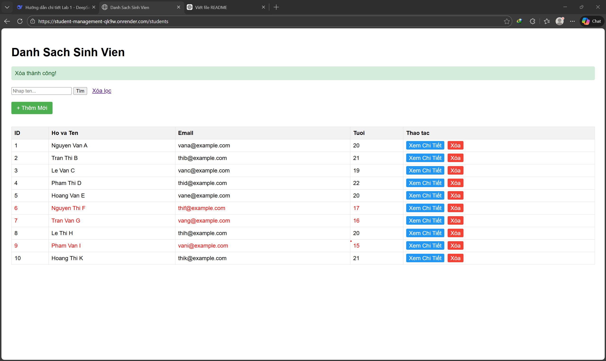
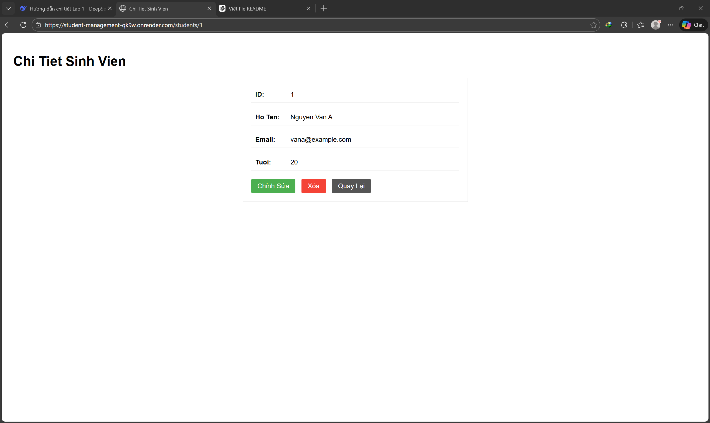
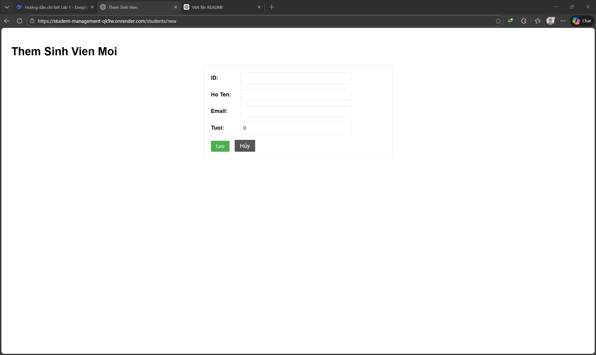
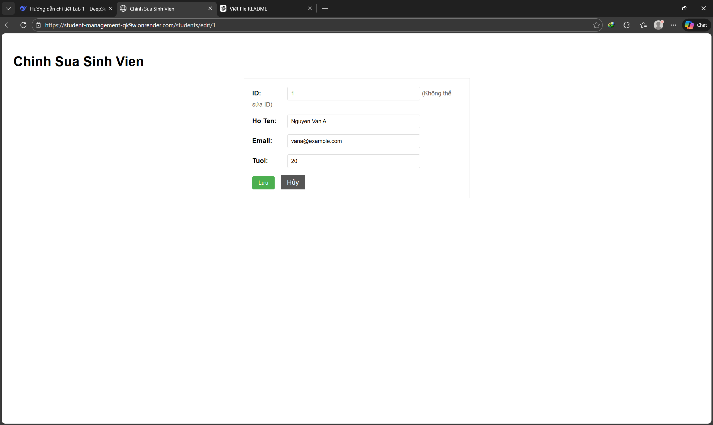
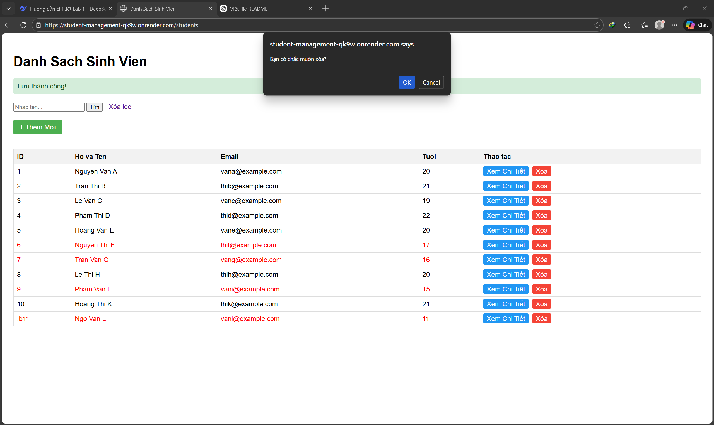

# Student Management System

## 📚 Giới thiệu

Đây là ứng dụng quản lý sinh viên được xây dựng bằng Java Spring Boot theo kiến trúc Layered Architecture. Ứng dụng cung cấp đầy đủ các chức năng CRUD (Thêm, Sửa, Xóa, Xem) cho thông tin sinh viên, bao gồm REST API và giao diện người dùng với Server-Side Rendering (Thymeleaf).

Dự án được thực hiện trong khuôn khổ môn học Advanced Software Engineering - HCMUT.

---

## 👥 Thông tin nhóm

- Thành viên 1: Huỳnh Minh Trọng - 2213671

---

## 🌐 Thông tin triển khai (Lab 5)

- Public URL (Trang chính): https://student-management-qk9w.onrender.com/students
- Platform (PaaS): Render.com
- Database (DBaaS): Neon.tech (PostgreSQL Serverless)
- Containerization: Docker

---

## 🛠️ Công nghệ sử dụng

- Java 17 / 21
- Spring Boot 3.x
  - Spring Web MVC
  - Spring Data JPA
  - Thymeleaf
- PostgreSQL (local và cloud)
- Maven (build tool)
- Docker (đóng gói ứng dụng)
- Git & GitHub (quản lý mã nguồn)

---

## 📁 Cấu trúc thư mục (Layered Architecture)
```
student-management/
├── src/main/java/vn/edu/hcmut/cse/adse/lab/
│   ├── controller/
│   │   ├── StudentController.java      (REST API)
│   │   └── StudentWebController.java   (SSR Web)
│   ├── service/
│   │   └── StudentService.java
│   ├── repository/
│   │   └── StudentRepository.java
│   └── entity/
│       └── Student.java
├── src/main/resources/
│   ├── application.properties
│   └── templates/
│       ├── students.html
│       ├── student-detail.html
│       └── student-form.html
├── Dockerfile
├── pom.xml
└── README.md
```

## 🚀 Hướng dẫn chạy dự án

### Yêu cầu hệ thống

- JDK 17 trở lên
- Maven (hoặc dùng Maven Wrapper mvnw có sẵn)
- PostgreSQL (cho Lab 4 trở đi) hoặc SQLite (cho Lab 1-3)
- Docker (tùy chọn, để chạy container)

### 1. Clone repository
```bash
git clone https://github.com/2213671/student-management.git
cd student-management
```
### 2. Cấu hình cơ sở dữ liệu
#### a. Với PostgreSQL (Lab 4 & 5)
- Tạo database tên `student_management`
- Cập nhật thông tin trong `application.properties`:

```properties
spring.datasource.url=jdbc:postgresql://localhost:5432/student_management
spring.datasource.username=postgres
spring.datasource.password=your_password
```

#### b. Với SQLite (Lab 1-3)
- Không cần cài đặt, file `student.db` sẽ tự động tạo
### 3. Chạy ứng dụng (các mode)
#### Chạy trực tiếp với Maven
```bash
# Trên Linux/Mac
./mvnw spring-boot:run

# Trên Windows (PowerShell)
.\mvnw spring-boot:run
```

#### Chạy với Docker
```bash
# Build image
docker build -t student-management .

# Run container
docker run -p 8080:8080 student-management
```
### 4. Truy cập ứng dụng
- **Giao diện người dùng**: http://localhost:8080/students
- **REST API**: http://localhost:8080/api/students

✅ Kết quả thực hiện theo từng Lab
Lab 1: Khởi tạo & Kiến trúc
Tạo project Spring Boot

Cấu hình SQLite

Tạo Entity Student (id dạng String)

Thêm dữ liệu mẫu với DB Browser

Lab 2: Xây dựng REST API
Tạo Repository, Service, Controller

API GET /api/students - danh sách

API GET /api/students/{id} - chi tiết

Lab 3: Frontend với Thymeleaf
Thêm Thymeleaf dependency

Tạo StudentWebController (@Controller)

Tạo view students.html

Form tìm kiếm theo tên

Tô màu đỏ sinh viên dưới 18 tuổi

Lab 4: Hoàn thiện CRUD & PostgreSQL
Chuyển từ SQLite sang PostgreSQL

Trang danh sách: bảng, tìm kiếm, nút "Thêm Mới", "Xem Chi Tiết"

Trang chi tiết: hiển thị đủ thông tin, nút "Chỉnh Sửa", "Xóa" (có confirm)

Thêm mới: form nhập liệu

Chỉnh sửa: form điền sẵn thông tin

Xóa: confirm dialog và redirect

Lab 5: Docker & Deployment
Tạo Dockerfile (multi-stage build)

Cấu hình biến môi trường

Tạo database trên Neon.tech

Deploy lên Render.com

Ứng dụng hoạt động public: https://student-management-qk9w.onrender.com/students

📸 Screenshots (Lab 4)
Trang danh sách (/students)


Trang chi tiết (/students/{id})


Trang thêm mới (/students/new)


Trang chỉnh sửa (/students/edit/{id})


Xác nhận xóa


## ❓ Câu trả lời lý thuyết

### Lab 1
**1. Tại sao database chặn insert trùng ID?**
Vì cột id được định nghĩa là PRIMARY KEY, có ràng buộc UNIQUE. Mỗi bản ghi phải có giá trị khóa chính duy nhất để đảm bảo tính toàn vẹn dữ liệu và phục vụ truy xuất nhanh.

**2. Insert bỏ trống cột name có báo lỗi không?**
Trong SQLite mặc định, không báo lỗi vì cột name chưa có ràng buộc NOT NULL. Điều này có thể gây NullPointerException khi code Java đọc dữ liệu nếu không kiểm tra null.

**3. Tại sao chạy lại ứng dụng mất dữ liệu?**
Do cấu hình spring.jpa.hibernate.ddl-auto=create. Cấu hình này bảo Hibernate xóa schema cũ và tạo mới mỗi khi ứng dụng khởi động.

### Lab 2
**1. Tại sao dùng @RestController thay vì @Controller?**
@RestController = @Controller + @ResponseBody. Nó tự động chuyển đổi dữ liệu trả về thành JSON, phù hợp cho REST API.

**2. Vai trò của @Autowired?**
Thực hiện Dependency Injection (DI). Spring tự động tạo và inject instance của dependency, giảm coupling giữa các lớp.

**3. Tại sao gọi là REST API?**
REST (Representational State Transfer) là kiến trúc API trả về dữ liệu (thường là JSON) thay vì giao diện HTML, và stateless (mỗi request độc lập).

### Lab 3
**1. Sự khác nhau giữa @Controller và @RestController?**
- @Controller: Trả về view (HTML)
- @RestController: Trả về dữ liệu (JSON)

**2. Vai trò của Model trong Spring MVC?**
Model là cầu nối giữa Controller và View, chứa dữ liệu để hiển thị trên giao diện. Dùng model.addAttribute() để truyền dữ liệu.

**3. Tại sao gọi là Server-Side Rendering (SSR)?**
HTML được render hoàn chỉnh ở server với dữ liệu đã được điền sẵn, trả về cho trình duyệt hiển thị trực tiếp.

📬 Thông tin liên hệ
GitHub Repository: https://github.com/2213671/student-management
```
